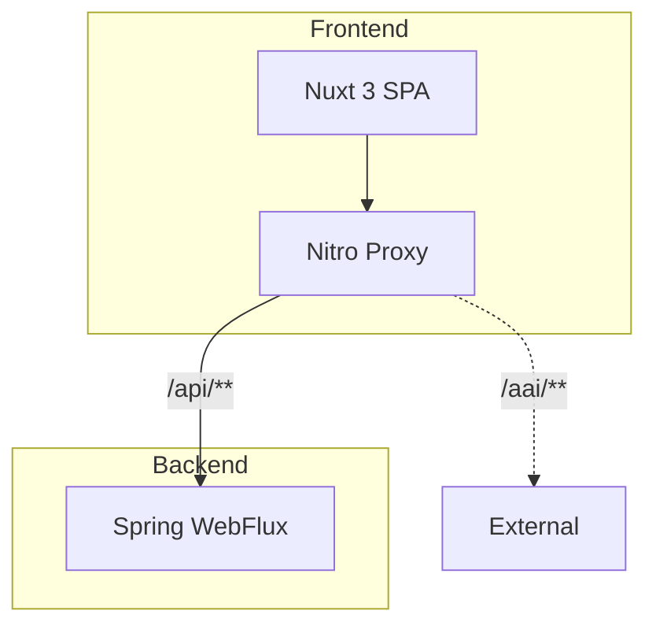
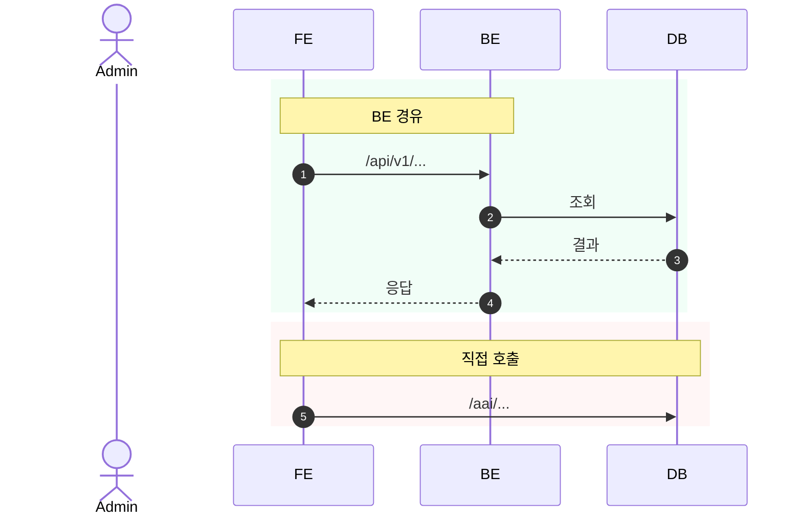
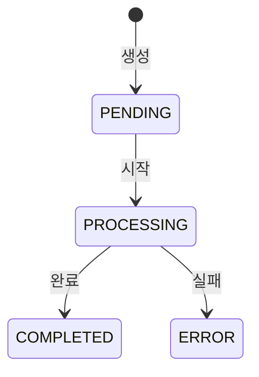

# 다이어그램 작성 가이드

## Mermaid (Confluence markdown 매크로)

### 기본 설정
```
<ac:structured-macro ac:name="markdown">
<ac:plain-text-body><![CDATA[
```mermaid
---
config:
  look: handDrawn
  theme: base
  themeVariables:
    primaryColor: '#dbeafe'
    primaryTextColor: '#1e3a5f'
    lineColor: '#6b7280'
    fontFamily: 'Helvetica, Arial, sans-serif'
---
(다이어그램)
```
]]></ac:plain-text-body>
</ac:structured-macro>
```

### 색상 팔레트 (classDef)
```
classDef fe fill:#dbeafe,stroke:#3b82f6,color:#1e3a5f
classDef be fill:#d1fae5,stroke:#10b981,color:#065f46
classDef db fill:#f1f5f9,stroke:#64748b,color:#334155
classDef ext fill:#fee2e2,stroke:#ef4444,color:#991b1b
classDef warn fill:#fef9c3,stroke:#eab308,color:#713f12
```

역할:
- `fe`: FE 계층 (청색)
- `be`: BE 경유 (녹색)
- `db`: 데이터베이스 (회색)
- `ext`: 외부 직접호출 (적색)
- `warn`: 주의/경고 (황색)

### Flowchart


- `-->` 실선: BE 경유
- `-.->` 점선: 직접 호출
- subgraph으로 영역 구분
- 노드 15개 이하

### Sequence Diagram


- `autonumber` 필수
- `rect rgb(...)` 영역 구분 (녹색=BE경유, 적색=직접호출)
- `actor` 사용자, `participant` 시스템
- 이모지 금지

### State Diagram


## draw.io (Confluence 첨부파일)

### 생성 방법
1. mxGraph XML로 `.drawio` 파일 작성
2. Confluence 페이지에 첨부파일 업로드 (curl)
3. `drawio` 매크로로 참조

```xml
<ac:structured-macro ac:name="drawio">
<ac:parameter ac:name="diagramName">{파일명.drawio}</ac:parameter>
</ac:structured-macro>
```

**`diagramName`에 확장자(.drawio) 반드시 포함.**

### 색상 규칙 (mxGraph style)
```
FE 영역: fillColor=#dae8fc;strokeColor=#6c8ebf
BE 영역: fillColor=#d5e8d4;strokeColor=#82b366
DB:      fillColor=#f5f5f5;strokeColor=#666666 + shape=cylinder3
External: fillColor=#f8cecc;strokeColor=#b85450
영역 border: dashed=1;dashPattern=5 5
직접 호출선: dashed=1;strokeColor=#b85450
```

### 적합한 용도
- 시스템 아키텍처 구성도 (영역/존 구분)
- 인프라 다이어그램 (K8s, 네트워크)
- 복잡한 컴포넌트 관계도

## 도구 선택 기준

| 판단 기준 | Mermaid | draw.io |
|----------|---------|---------|
| 레이아웃 자유도 필요 | - | O |
| 코드로 자동 생성 | O | △ (XML) |
| 시퀀스/플로우 | O | - |
| 영역(zone) 구분 | △ (subgraph) | O |
| DB shape (실린더) | △ | O |
| 수정 용이성 | O (텍스트) | △ (XML) |

**기본 규칙: Mermaid를 먼저 시도하고, 레이아웃이 중요한 아키텍처만 draw.io 사용.**
